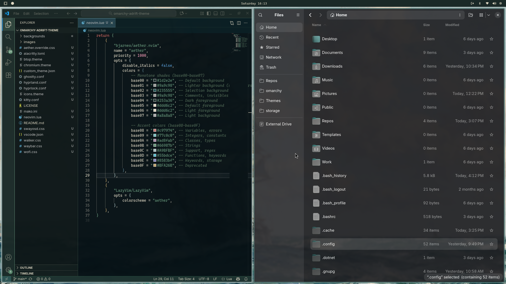
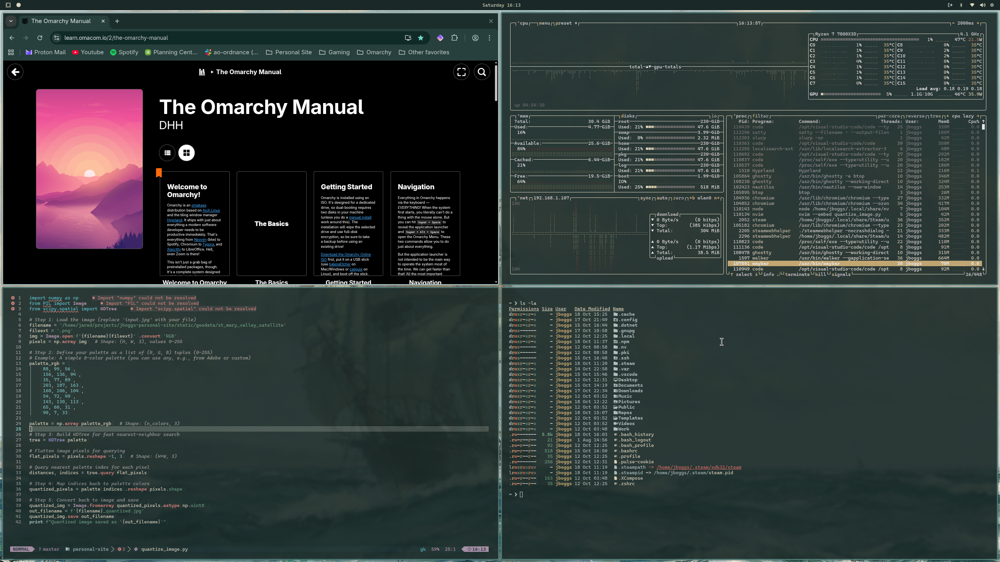
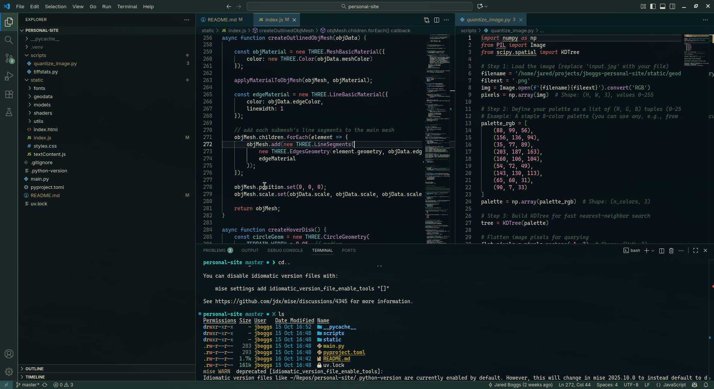
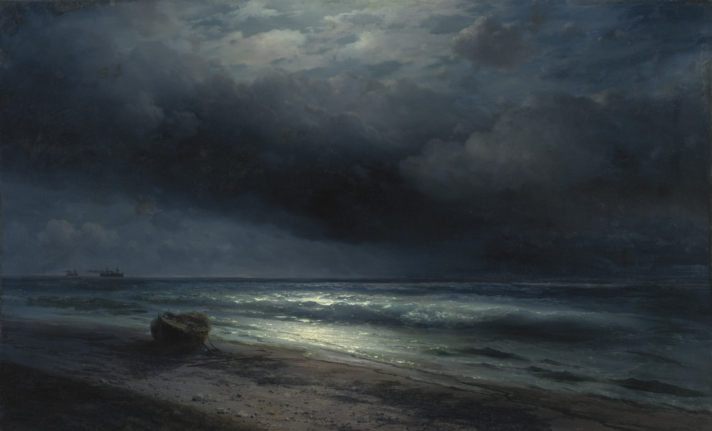

# omarchy-adrift-theme

Adrift is a simple blue and green dark-ish theme for Omarchy Linux.
It covers all standard Omarchy apps, Ghostty/Kitty/Alacritty, and VSCode.

Adrift is inspired by shipwrecks, the sea foam at night, and that odd sense of calm in the middle of a storm.

## Screenshots

## Wallpapers
Wallpaper images are sourced from [wallhaven](wallhaven.cc).
All images remain the property of their original creators.
If you created one of these images and you want it removed from this repository, please contact me or open an issue.

## Links
Omarchy was created with the help of the amazing [Aether](https://github.com/bjarneo/aether) and [Omarchist](https://github.com/tahayvr/omarchist) applications.
Check them out!

[VSCode Adrift Theme Extension](https://marketplace.visualstudio.com/items?itemName=JBoggsDev.adrift-theme) (auto-installed by Omarchy theme install script)

[Tip Jar](https://ko-fi.com/jboggsdev)

### Enjoy!