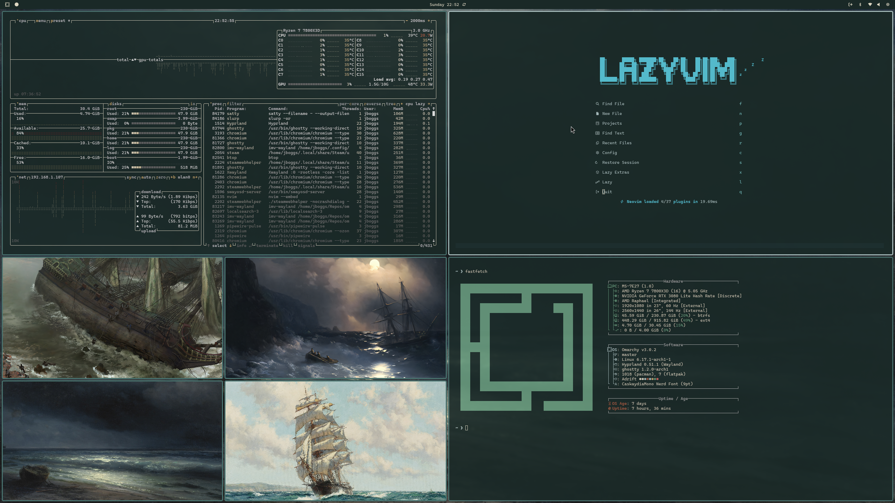
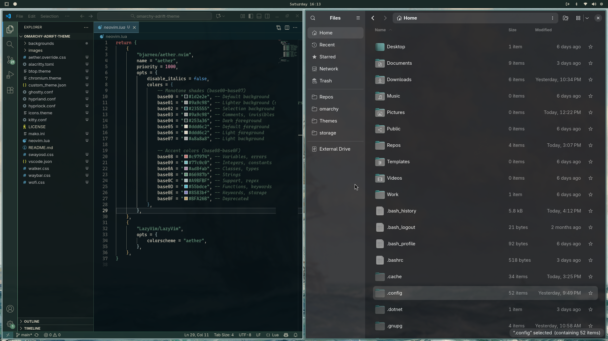
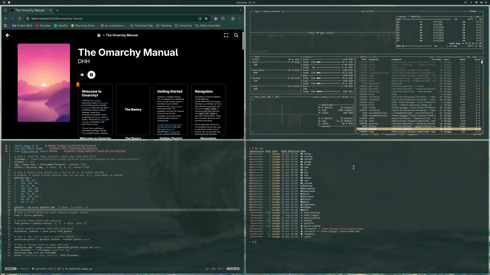
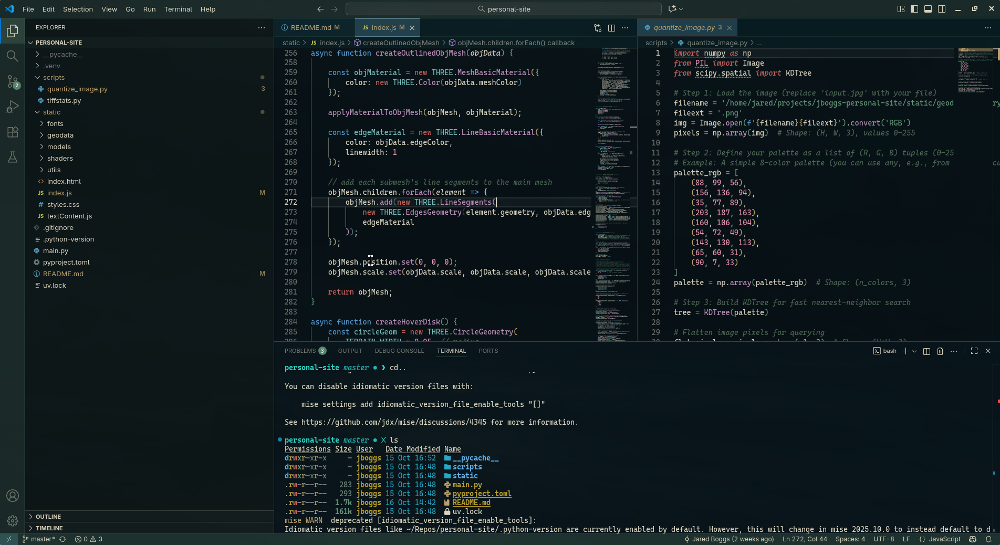
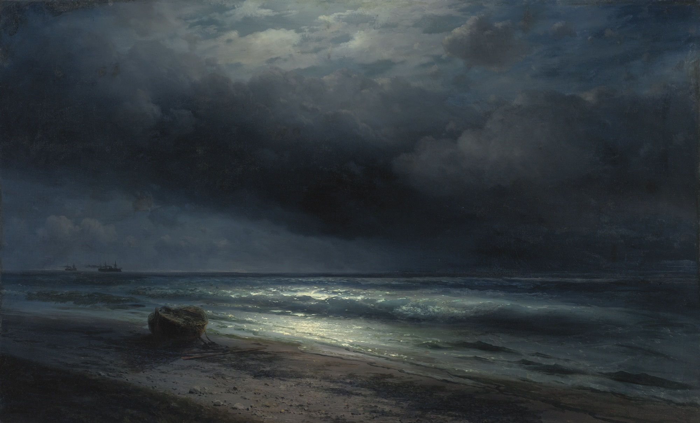

# omarchy-adrift-theme



Adrift is a simple blue and green dark-ish theme for Omarchy Linux.
It covers all standard Omarchy apps, Ghostty/Kitty/Alacritty, and VSCode.

Adrift is inspired by shipwrecks, the sea foam at night, and that odd sense of calm in the middle of a storm.

## Install

```bash
omarchy theme install https://github.com/jaredb1011/omarchy-adrift-theme
```

Omarchy 4 (Quattro) and later generate the shell, terminals, Hyprland borders, Neovim, and VS Code from `colors.toml`. The Waybar, Mako, Walker, Wofi, SwayOSD, and Hyprlock files remain for Omarchy 3.x.

On Omarchy 4, cloned themes cannot ship Lua, terminal configs, or `vscode.json`, so those are regenerated from the palette. The [VSCode Adrift Theme extension](https://marketplace.visualstudio.com/items?itemName=JBoggsDev.adrift-theme) is no longer auto-installed.

## Screenshots





## Wallpapers
Wallpaper images are sourced from [wallhaven](wallhaven.cc).
All images remain the property of their original creators.
If you created one of these images and you want it removed from this repository, please contact me or open an issue.





## Links
Omarchy was created with the help of the amazing [Aether](https://github.com/bjarneo/aether) and [Omarchist](https://github.com/tahayvr/omarchist) applications.
Check them out!

[VSCode Adrift Theme Extension](https://marketplace.visualstudio.com/items?itemName=JBoggsDev.adrift-theme)

[Tip Jar](https://ko-fi.com/jboggsdev)

### Enjoy!
